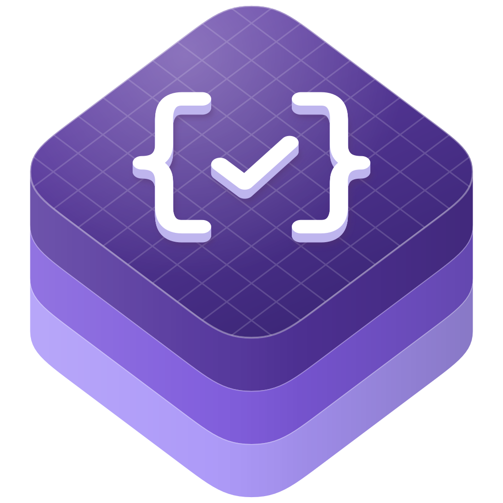

<p align="center">
  
</p>

<h1 align="center">swift-json-schema</h1>

<p align="center">
  Parse exact JSON values, build schemas, and validate five JSON Schema drafts.
</p>

<p align="center">
  <a href="https://github.com/swift-library/swift-json-schema/actions/workflows/ci.yml"></a>
  
  
  <a href="LICENSE.txt"></a>
</p>

[Overview](#overview) · [Install](#install) · [Quick start](#quick-start) ·
[Build a schema](#build-a-schema) · [CLI](#cli) · [Conformance](#conformance) ·
[Benchmarks](#benchmarks) · [Requirements](#requirements) ·
[Documentation](#documentation) · [Contributing](#contributing) · [License](#license)

> [!NOTE]
> swift-json-schema is pre-1.0. Minor releases may include source-breaking
> changes, so depend on it with `.upToNextMinor(from:)`.

## Overview

swift-json-schema combines an ordered JSON value model with schema compilation,
validation, typed construction, and a command-line tool. Choose the products
your application needs:

| Product | Purpose |
| --- | --- |
| `JSONValue` | Parse and serialize JSON, retain number tokens and object order, resolve pointers, and convert Codable values. |
| `JSONSchema` | Compile and validate schemas, resolve registered references, and produce structured results. |
| `JSONSchemaBuilder` | Build schemas with a typed DSL or generate them with `@Schemable`. |
| `JSONSchemaConversion` | Extract Foundation URLs, UUIDs, dates, decimals, and data from validated JSON. |
| `JSONSchemaFoundationModels` | Convert supported schema shapes into Foundation Models generation and tool-input schemas. |
| `json-schema` | Check schemas, validate instances, and bundle referenced schemas from the command line. |

The validator supports drafts 2020-12, 2019-09, 07, 06, and 04. It selects a
declared `$schema` or uses the compiler's fallback dialect, which defaults to
2020-12. Compiled schemas are immutable and `Sendable`; each validation call
keeps its own evaluation state.

## Install

Add the package and the products you need to `Package.swift`:

```swift
dependencies: [
  .package(
    url: "https://github.com/swift-library/swift-json-schema.git",
    .upToNextMinor(from: "0.1.0")
  ),
],
targets: [
  .target(
    name: "YourTarget",
    dependencies: [
      .product(name: "JSONValue", package: "swift-json-schema"),
      .product(name: "JSONSchema", package: "swift-json-schema"),
    ]
  ),
]
```

## Quick start

Parse a schema once, then reuse its compiled validator:

```swift
import JSONSchema
import JSONValue

func validationExample() throws {
  let definition: JSONValue = ["type": "integer", "minimum": 0]
  let validator = try SchemaCompiler().compile(definition)
  let result = validator.validate(42)
  precondition(result.valid)
  precondition(result.output(.flag) == ["valid": true])
}
```

Use `result.errors` for location-rich failures, `result.humanReadable` for text,
or `result.output` with `.flag`, `.basic`, `.detailed`, or `.verbose` for JSON
output. Compilation resolves a schema graph; call `checkSchema()` on the
compiled schema to validate the schema itself against its metaschema.

Reference resolution is offline by default. Add external documents to
`SchemaRegistry.bundled` with `register(_:at:)`, or use asynchronous compilation
with an explicit HTTPS host policy. Relative file references are not loaded
automatically. Compound bundling requires draft 2020-12.

`format` is an annotation unless format assertion is enabled. Content evaluation
is also opt-in. Parser nesting defaults to 256 and evaluation depth to 512;
both limits are configurable.

## Build a schema

Add the `JSONSchemaBuilder` product to use the DSL and macros:

```swift
import JSONSchemaBuilder

@Schemable
struct Person: Codable {
  @SchemaConstraint(minLength: 1)
  var name: String
  @SchemaConstraint(minimum: 0)
  var age: Int
}

func builderExample() throws {
  let definition = Schema.object {
    SchemaProperty("name", Schema.string().minLength(1))
    SchemaProperty("age", Schema.integer().minimum(0))
  }.additionalProperties(false)
  let value: JSONValue = ["name": "Ada", "age": 42]
  let person = try definition.decode(Person.self, from: value)
  precondition(person.name == "Ada")
  let generated = try Person.decode(from: value)
  precondition(generated.age == 42)
}
```

Both paths validate before decoding. A valid JSON number may still exceed the
range of its Swift destination type, so typed extraction can throw after
validation succeeds. A schema `default` is an annotation; it does not fill a
missing required property.

`JSONValue` preserves exact number tokens in compact and pretty output. Its
canonical serialization uses RFC 8785 binary64 number semantics and UTF-16 key
ordering; numbers outside the canonical representation's range throw.

## CLI

Run the executable from a checkout:

```sh
swift run json-schema check schema.json --output human
swift run json-schema validate schema.json instance.json --output basic
swift run json-schema validate schema.json instance.json --draft 7 --assert-formats
swift run json-schema bundle schema.json --registry https://example.test/number=number.json
```

Use `-` for stdin. `--draft` accepts `2020-12`, `2019-09`, `7`, `6`, or `4`.
`--output` accepts `flag`, `basic`, `detailed`, `verbose`, or `human`.
`--registry URI=FILE` registers a local document; `--allow-host HOST` allows
HTTPS resolution for that host. Both options are repeatable.

Exit status is `0` for valid input or a successful command, `1` for an invalid
instance or metaschema check, and `2` for usage, parsing, compilation, or
resolution errors.

## Conformance

The vendored JSON Schema Test Suite revision and archive checksum are recorded
in [Tests/Fixtures.lock.json](Tests/Fixtures.lock.json). Required files run
without case filtering. Format tests enable format assertion; the other
optional tests enable content evaluation.

| Draft | Required | Optional formats | Other optional |
| --- | ---: | ---: | ---: |
| 2020-12 | 1301 / 1301 | 874 / 874 | 162 / 162 |
| 2019-09 | 1261 / 1261 | 874 / 874 | 158 / 158 |
| 07 | 929 / 929 | 793 / 793 | 118 / 118 |
| 06 | 841 / 841 | 409 / 409 | 106 / 106 |
| 04 | 618 / 618 | 291 / 291 | 99 / 100 |

The draft-04 optional `zeroTerminatedFloats.json` mismatch remains visible in
the report: this implementation treats `1.0` as a mathematical integer for
every draft. The fixture expects it not to satisfy `integer` in draft-04.
Required assertions total **4950 / 4950**; optional format assertions total
**3241 / 3241**. These results cover the locked fixture revision, not every
possible schema. `Scripts/check` regenerates per-draft reports under
`.build/compliance/`.

## Benchmarks

One recorded Release run on an Apple M2 Max, macOS 27.0.1 arm64, Swift 6.4
(`swiftlang-6.4.0.34.1`), and Xcode 27.0 (`27A266a`) produced these timings.
The workload contains 1000 object records and 43,281 bytes of compact JSON;
each operation uses 10 warmup iterations and 100 measured iterations.
Validation reuses a compiled schema; compilation is measured separately.

| Operation | Mean (ms) | Median (ms) | P95 (ms) |
| --- | ---: | ---: | ---: |
| Parse 1000 records | 8.596 | 3.820 | 35.766 |
| Canonicalize 1000 records | 8.441 | 4.757 | 28.402 |
| Compile array schema | 0.509 | 0.146 | 0.991 |
| Validate 1000 records | 81.057 | 76.633 | 149.042 |

Timings vary with hardware and system load. Run the same workload with
`swift run --package-path Benchmarks -c release SchemaBenchmarks`; its source
is in [Benchmarks](Benchmarks/Sources/SchemaBenchmarks/Measurements.swift).

## Requirements

- Swift 6.2 or later, using Swift 6 language mode.
- iOS 18+ or macOS 15+. CI also configures Linux builds and tests.
- Foundation Models bridging requires iOS 26+ or macOS 26+ and an SDK that
  provides Foundation Models. It accepts a representable subset and throws
  for unsupported shapes or keywords. Validate generated content with the
  original schema.

## Documentation

- [JSON values and exact serialization](Sources/JSONValue/JSONValue.docc/GettingStarted.md)
- [Schema compilation and validation](Sources/JSONSchema/JSONSchema.docc/GettingStarted.md)
- [Schema builders and macros](Sources/JSONSchemaBuilder/JSONSchemaBuilder.docc/GettingStarted.md)
- [Foundation conversions](Sources/JSONSchemaConversion/JSONSchemaConversion.docc/GettingStarted.md)
- [Foundation Models bridge](Sources/JSONSchemaFoundationModels/JSONSchemaFoundationModels.docc/GettingStarted.md)
- [Versioning and release policy](Documentation/Architecture/VersioningAndRelease.md)

## Contributing

See [Contributing](CONTRIBUTING.md). Run `Scripts/check` for formatting, tests,
the Release build, CLI checks, compiling examples, and DocC validation on macOS.

## License

[Apache-2.0 WITH Swift-exception](LICENSE.txt). Vendored test suites retain
their licenses beside the test data.
